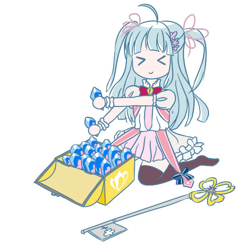

***
### MetaBegin
| key | value |
| --- | ----- |
| title | Example Article |
| author | DreDiki |
| lang | en |
| cover | cover.png |
### MetaEnd
***

[WIP]

It is suggested to learn markdown by this [site](https://markdown-it.github.io/)

---

## Meta info

Meta info is required. Every article must begin with lines just as above, which ends with ***.

Supported __lang__: jp en zh ko (日本語 English 汉语 한국어) 

__cover__ is optional, you may remove that line. It is suggested to use pictures with resolution 128x128.

---

# h1 Heading 8-)
## h2 Heading
### h3 Heading
#### h4 Heading
##### h5 Heading
###### h6 Heading

---

## Links & Images

Link to [Ayaya](https://wiki.kirafan.moe/#/chara/14032000)

Your local image filename may not begin with word __static/__, which will redirect to the files in wiki.

